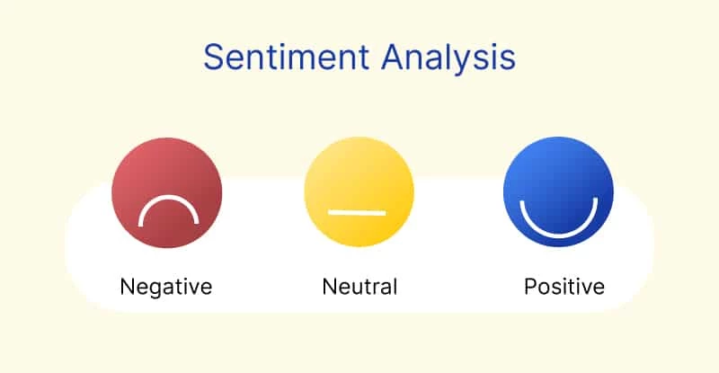
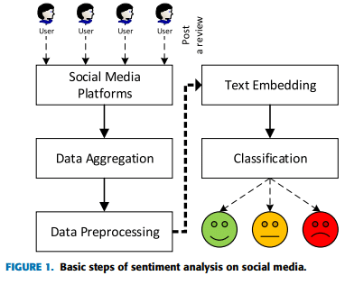
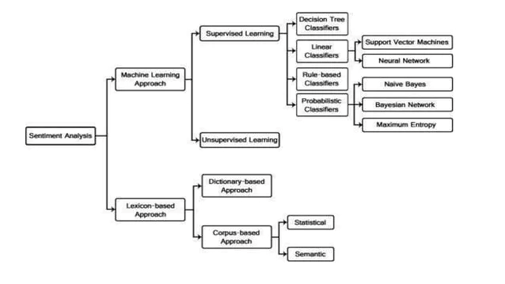
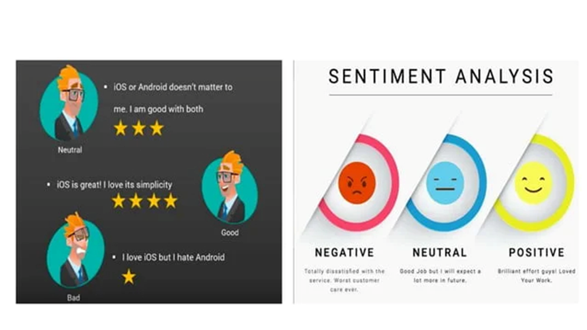

**#Sentiment Analysis**

<n3>Sentiment analysis can be performed using various approaches, including rule-based methods, machine learning techniques, and deep learning models. Here are the general steps involved in sentiment analysis:</h3>  

    1-Data Preparation: The text data, such as reviews, social media posts, 
    or customer feedback, needs to be collected and preprocessed.
    This involves tasks like removing irrelevant information,  
    tokenization (splitting text into individual words or phrases),
    and removing stop words (commonly used words like "and," "the," etc. 
    that do not carry much meaning). 

    2-Feature Extraction: The preprocessed text is then transformed into a numerical 
    representation that machine learning algorithms can understand. Common techniques 
    for feature extraction include bag-of-words (representing text as a set of words and 
    their frequencies), TF-IDF (Term Frequency-Inverse Document Frequency), or word embeddings 
    (such as Word2Vec or GloVe) that capture semantic relationships between words. 

    3-Training Data and Labeling: A labeled dataset is required to train a sentiment analysis model.
    This dataset consists of text samples along with their corresponding sentiment labels 
    (positive, negative, or neutral). Human annotators often label the data, or pre-existing 
    labeled datasets can be used. 

    4-Model Training: Machine learning algorithms, such as Naive Bayes, Support Vector Machines (SVM), 
    or deep learning models like Recurrent Neural Networks (RNNs) or Transformers, can be used to train 
    a sentiment analysis model. The model learns to recognize patterns and associations between the 
    textual features and the sentiment labels. 

    5-Evaluation and Validation: The trained model is evaluated using a separate set of labeled data,
    called the validation or test set. Various evaluation metrics, such as accuracy, precision, recall,
    or F1 score, can be used to assess the model's performance. 

    6-Sentiment Classification: Once the model is trained and validated, it can be used to classify new,
    unseen text data into positive, negative, or neutral sentiment categories. The model assigns a 
    sentiment label based on the learned patterns and associations in the training phase.  

Sentiment analysis has various applications, including customer feedback analysis, social media monitoring, brand monitoring, market research, and sentiment-driven decision-making in businesses. It helps organizations gain insights into public opinion, customer satisfaction, and overall sentiment towards their products or services.

<h3>In this demo we will use the transformers model to detect the feelings of the customer in the comments on a product, the data are stored in an RDF file generated by the rdflib library and to classify them as positive, negative and neutral comments in order to see whether the product meets customer needs or not.</h3> 

    
 <B>Transformers</B>: are a type of deep learning model architecture that has gained significant attention 
    and popularity in the field of natural language processing (NLP). They have revolutionized the way 
    we approach various NLP tasks, including machine translation, sentiment analysis, 
    question answering, and more.
  
    
<B>rdflib</B> :is a Python library for working with Resource Description Framework (RDF) data. 
    RDF is a standard model for representing structured and linked data on the web.
    rdflib provides a set of tools and utilities for creating, manipulating, and querying RDF graphs.

